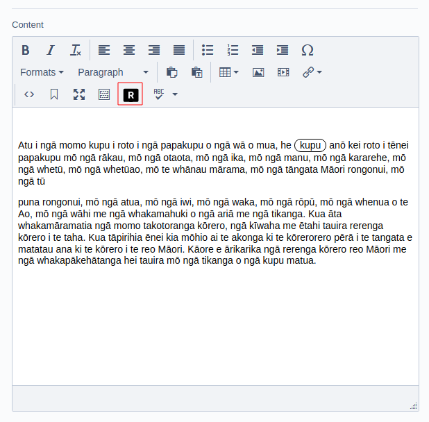
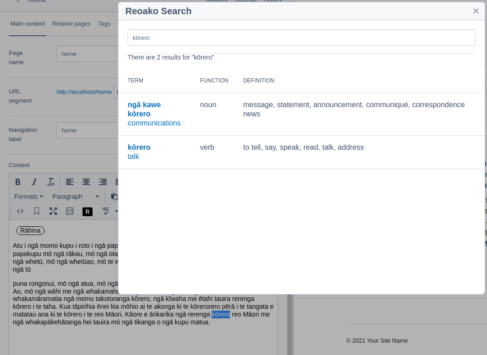
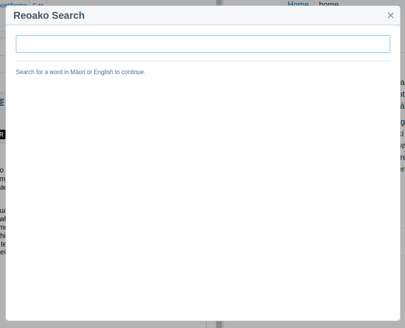
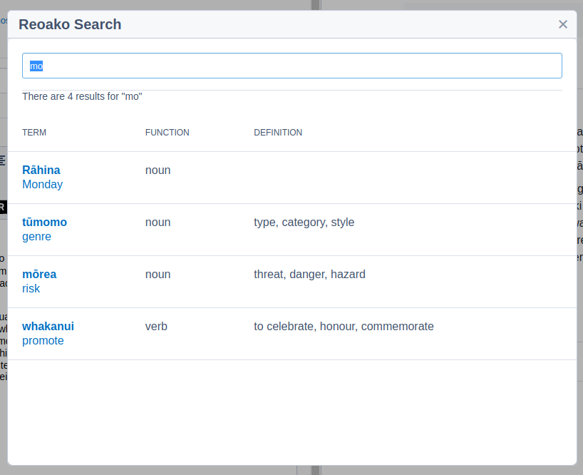
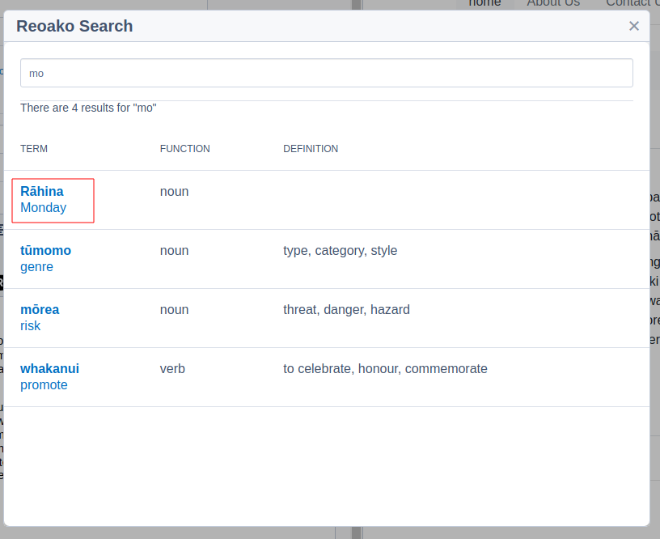

# <a src="https://www.reoako.nz/">Reoako</a>

The Reoako silverstripe CMS package helps content managers to embrace the
use of our national language in Aotearoa. Use te reo Māori correctly, in the right context, and support your readers with word definitions and pronunciation.


## Requirements

-   Silverstripe 4.X
-   Composer
-   Reoako API key - <a src="https://www.reoako.nz/">Register here for more info </a>

### Tested on

-   CWP recipe 2.8
-   Silverstripe 4.8
-   PHP 7.4

## Components

The Reoako silverstripe package consists of 4 components.
.

#### TinyMCE plugin

Allows content editors to search and insert translations into richfields via TinyMCE.

#### Reoako PHP client

Used to authenticate and make requests to the Reoako API for translations by the TinyMCE plugin

#### Reoako Silverstripe settings tab (optional)

Allows a site admin to set the api key via the settings tab.

> If this extension is not applied you will need to set the API key via yml or .env - see below

#### Reoako frontend extension (optional)

Injects the Reoako javascript and css bundles to all frontend views.

> If this extension is not applied you will need to include the Reaoko frontend package via your own theme build process

https://www.npmjs.com/package/@octavenz/reoako

## Installation

1. `$ composer require octavenz/reoako:0.1.0`

2. `dev build and flush`

## Extensions and Configuration

Depending on your setup you will need to apply some extensions

To apply the extensions create a config/reoako.yml file in your codebase and copy the following examples into it.

> You will need to run a dev build after adding the extensions

### Required extensions

#### Shortcode extension

Adds the shortcode extension to allow the Reoako Shortcode in be used in content fields

```
SilverStripe\CMS\Model\SiteTree:
  extensions:
    - Octavenz\Reoako\Extensions\ReoakoShortCodeExtension
```

#### Tinymce extension

Adds the Reoako Tinymce plugin to richfields

```
SilverStripe\Admin\LeftAndMain:
  extensions:
    - Octavenz\Reoako\Extensions\ReoakoTinymceExtension
```

#### Tinymce CSS injection

Adds css to the TinyMCE editor iframe to allow for highlighting of reoako tags

```
SilverStripe\Forms\HTMLEditor\TinyMCEConfig:
  editor_css:
    - "octavenz/reoako:dist/css/editor.css"
```

## Optional extensions

#### Site config

Adds a tab and field in the site config to allow an admin to set the Reoako API key

```
SilverStripe\SiteConfig\SiteConfig:
  extensions:
    - Octavenz\Reoako\Extensions\ReoakoSiteConfig
```

#### Reoako frontend extension

Injects the required Reoako frontend javascript and css to all frontend pages
> Note: requires that the ReoakoSiteConfig be applied as well.

```
SilverStripe\CMS\Model\SiteTree:
  extensions:
    - Octavenz\Reoako\Extensions\ReoakoFrontendExtension
```

## Setting your API key

A Reoako API key is required

Set it via one of the following methods:

### .env

Set your api key in your .env file or via your environment variable

```
SS_REOAKO_API_KEY = <KEY>

```

### Settings panel

Navigate to: /admin/settings/#Root_Reoako

set your API key in the field.

### YML

Set you key via yml in your config

```
Octavenz\Reoako\Client\ReokakoClient:
  api_key: <KEY>
```

## Using the TinyMCE plugin

When the Reoako plugin is enabled in TinyMCE, you will notice a new Reoako button.



You can press the Reoako button when text is selected to perform a search for the selected word.



If no text is selected when pressing the Reoako button, you will be prompted to enter a word to search for.





When you have found a word you wish to insert, click on its title to insert the Reoako shortcode into the editor



### TODO:

-   Ajax search on character entry
-   Subsite support
-   Bitbucket pipeline tests
-   SS4/CWP tests
